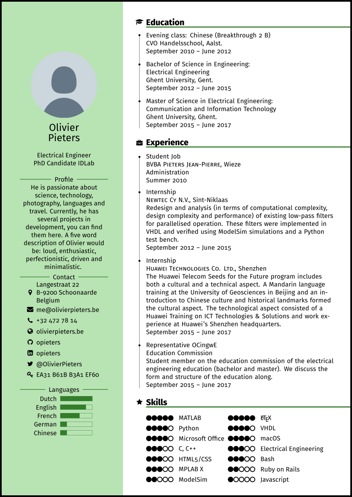

Design Tutorial Files for LimeCV XeLaTeX Documentclass
======================================================

These files are part of [this tutorial series](https://olivierpieters.be/blog/archive/tag/limecv).

Example CV:

  

Also checkout t[he repository of the final document class](https://github.com/opieters/limecv) that inspired this repository and tutorial series.

Requirements
------------

* Recent TeX installation (tested on a 2017 one)
* XeLaTeX
* [Font Awesome](https://github.com/xdanaux/fontawesome-latex)
* [Fira Font](https://github.com/mozilla/Fira)
* LaTeX packages (available from CTAN, see source)

Build Documents
---------------

This part is not finished yet. 

You can build the documents using the `build.sh` file.

License
-------

GNU GPLv3. See LICENSE file.

© 2017 Olivier Pieters